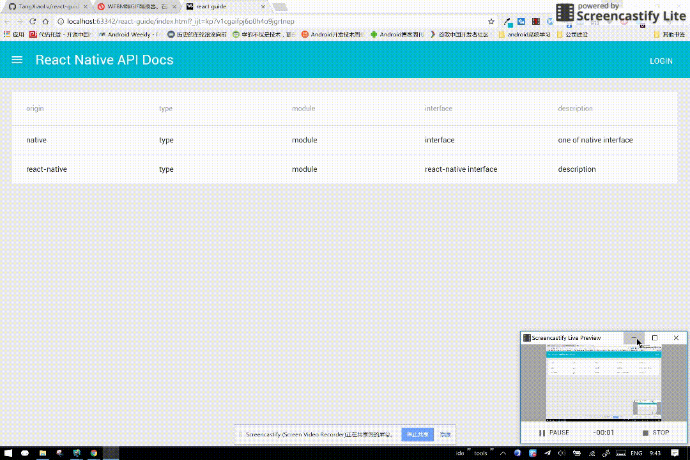

# react-guide
    A webapp named docs implementation by Material Design and React

## Library
- [Redux](https://github.com/reactjs/redux)
- [react-redux](https://github.com/reactjs/react-redux)
- [react-thunk](https://github.com/gaearon/redux-thunk)
- [redux-logger](https://github.com/evgenyrodionov/redux-logger)
- [wilddog](https://www.wilddog.com/dashboard/)
- [material-ui](http://www.material-ui.com/#/)
- [webpack](https://webpack.github.io/docs/)

## Development Workflow
    npm install
    build
